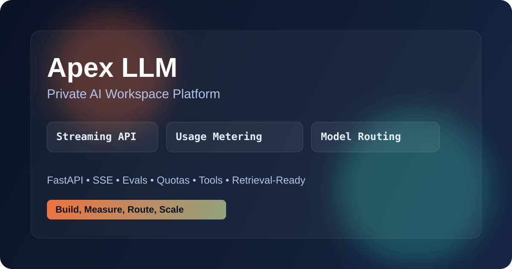
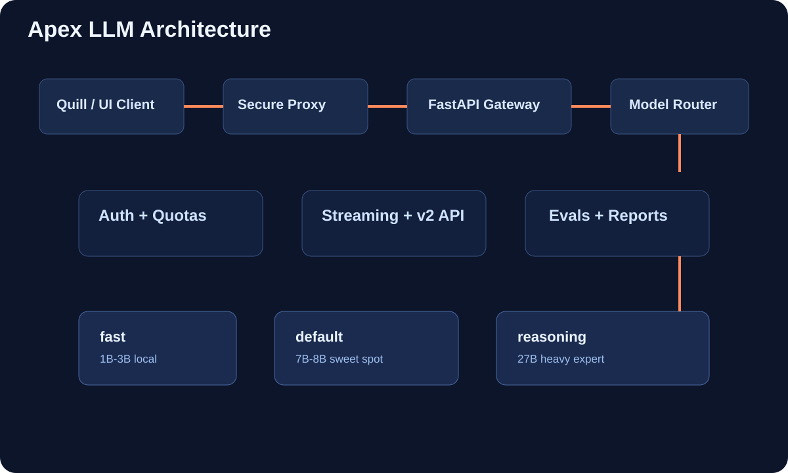
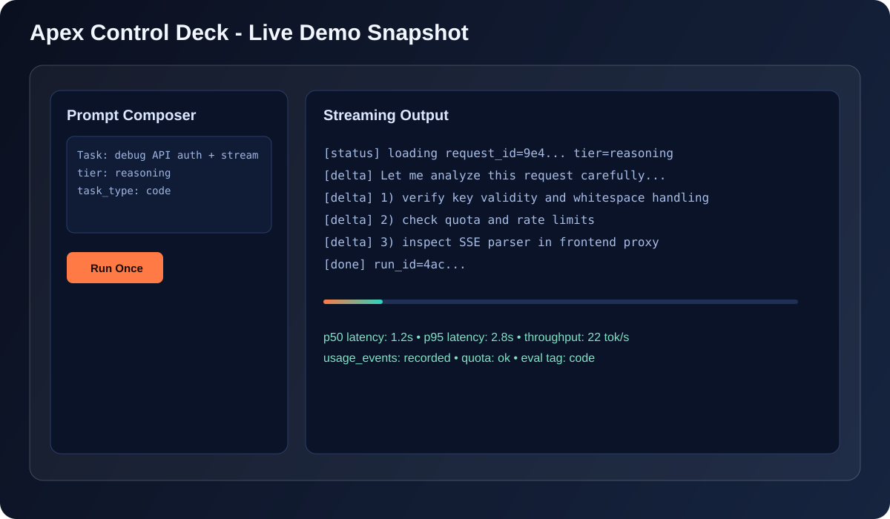

# Apex LLM

Apex LLM is a local-first FastAPI gateway for chat inference, model-tier routing, usage metering, and LoRA experimentation.



[](https://github.com/tovrr/Apex_LLM/actions/workflows/ci.yml)


## What You Get

- FastAPI chat API with API-key auth and quotas.
- Request-id structured logging and usage ledger.
- Model tiers: fast, default, reasoning.
- v2 chat contract with context chunks and tools metadata.
- LoRA training pipeline with Colab-ready notebook.
- Quill proxy templates for server-side key injection.

## Architecture



## Live Demo Snapshot



## Current Model Routing

- fast: microsoft/Phi-3-mini-4k-instruct
- default: Qwen/Qwen2.5-7B-Instruct
- reasoning: Jackrong/Qwen3.5-27B-Claude-4.6-Opus-Reasoning-Distilled

Routing is configured via environment variables in [.env.example](.env.example).

## Quick Start

### 1) Install dependencies

```powershell
python -m venv venv
venv\Scripts\python.exe -m pip install --upgrade pip
venv\Scripts\python.exe -m pip install -r requirements.txt
```

### 2) Configure environment

Create [.env](.env) from [.env.example](.env.example) and set at least:

```dotenv
APEX_API_KEY=your_key_here
APEX_MODEL_FAST_NAME=microsoft/Phi-3-mini-4k-instruct
APEX_MODEL_FAST_LORA_DIR=./apex_lora_sauvegarde
```

For local low-RAM development, you can bypass heavy model loading:

```dotenv
APEX_SKIP_MODEL_LOAD=1
```

### 3) Run API

```powershell
venv\Scripts\python.exe -m uvicorn serveur_api:app --reload
```

Health check:

```powershell
Invoke-RestMethod -Uri "http://127.0.0.1:8000/health" -Method GET
```

## API Surface

- POST /chat
- POST /chat/stream
- POST /chat/v2
- GET /api/tools
- GET /api/usage
- GET /api/status
- GET /api/runs
- GET /developer
- GET /pricing

## Distillation Workflow

### Local validation

Validate dataset file format and minimum size:

```powershell
venv\Scripts\python.exe evals/validate_dataset_expert.py --file dataset_expert_v4.json --min-count 200
```

Generate a 100-example template dataset (project helper):

```powershell
venv\Scripts\python.exe evals/generate_dataset_expert_100.py
```

### GPU training (Colab)

Use [colab_finetune.ipynb](colab_finetune.ipynb), then export `apex_lora_final.zip` and update [apex_lora_sauvegarde](apex_lora_sauvegarde).

Current defaults in [apex_lora.py](apex_lora.py):

- Base model: `unsloth/phi-4-unsloth-bnb-4bit`
- Dataset: `dataset_expert_v4.json`
- LoRA smoke profile: `max_steps=10`

Recommended Colab sequence:

1. Restart runtime before retrying after any training crash.
2. Re-run cells 1 -> 2 -> 3 -> 4 in order.
3. Only run export/download after training finishes without traceback.

Note: the notebook prints `=== FINE-TUNING COMPLETE ===` after the shell command returns; always verify the logs above for traceback-free completion.

## Testing

```powershell
venv\Scripts\python.exe -m pytest -q
```

CI runs on push and pull request through [ci.yml](.github/workflows/ci.yml).

## Repository Map

- [serveur_api.py](serveur_api.py): FastAPI server and model routing.
- [key_store.py](key_store.py): API keys, quotas, usage events.
- [apex_lora.py](apex_lora.py): LoRA training entrypoint.
- [dataset_expert_v4.json](dataset_expert_v4.json): Current distillation dataset.
- [evals](evals): Dataset validation and eval helpers.
- [quill-proxy](quill-proxy): Next.js proxy templates.

## Notes

- Keep secrets out of git. Use [.env](.env) locally.
- LoRA artifacts and backups should stay local unless intentionally published.
